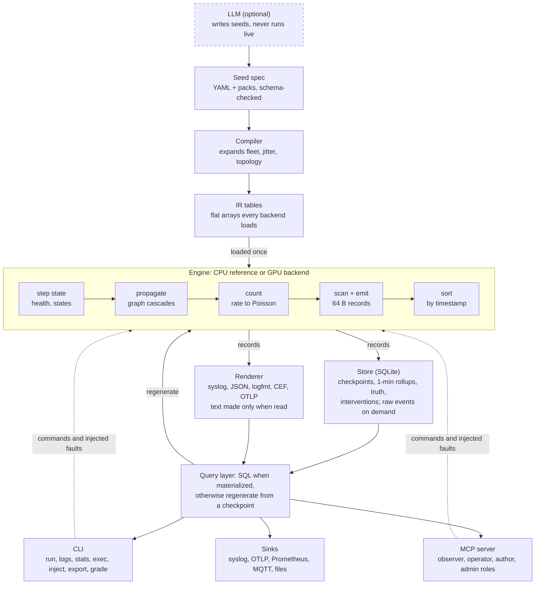
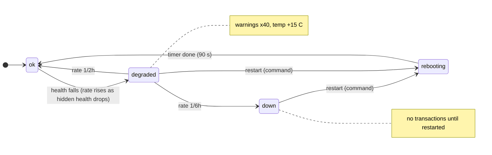

# simo — Math-Driven Log & Event Simulator (Design)

Design document · October 2026 · Living version: this file is the source of truth in the repo.

## Summary

simo is a Go simulator that generates realistic logs, metrics and events for a fleet of virtual devices using plain math: stochastic processes, state machines and graph propagation. No machine learning sits in the generation path. An LLM only writes a compact seed spec; the engine expands it deterministically into millions or billions of records, on CPU or GPU, and serves them through a CLI and an MCP server.

**Goals**

- **Sensible data:** daily and weekly rhythms, bursts, heavy tails, correlated metrics, causal fault chains with early warning signs, and harmless background noise.
- **Deterministic:** the same seed and spec give byte-identical output on any machine.
- **Scale:** the GPU generates compact numeric event records; text is rendered only when someone reads it.
- **Interactive:** agents read logs, query device state, run commands on virtual devices and inject failures.
- **LLM-optional:** runs fully offline. The LLM authors seeds and message templates; it never sits in the hot loop.
- **Ground truth:** every injected fault and anomaly is labelled, so an agent's diagnosis can be graded.

**Non-goals for v1**

- Machine learning in the generation hot loop. ML is an optional CPU module, and any model that shapes generation must compile down to the same math tables (see Machine learning on CPU).
- Bit-exact emulation of one vendor's firmware.
- Replacing a log pipeline such as Loki or Elasticsearch; simo feeds them.

**Four design principles**

1. **Events are numbers, text is a view.** The engine emits fixed-size binary records (time, device, template, slot values). Log lines are rendered from them on read.
2. **Everything is a pure function of (seed, entity, stream, time).** That gives random access, GPU parallelism, and the option to regenerate data instead of storing it.
3. **Hidden state drives visible symptoms.** Each device has a hidden health state; its logs and metrics are noisy observations of that state. This is what makes the data diagnosable rather than just random.
4. **CPU is the reference, GPU is the accelerator.** Both run the same kernels and must produce the same records.

## Architecture

Data flows one way, from seed to readers. Only two things loop back into the engine: commands and injected faults, and reads of windows that were never stored.



The store keeps only what must persist; every read either hits SQLite or regenerates the window from a checkpoint. Agents and people come in through the CLI and MCP, existing log tools through the sinks.

## Determinism: counter-based randomness

Every random number is computed, not drawn from a running generator: `u = Philox4x32-10(key, counter)`. This one choice makes the system reproducible, GPU-parallel and randomly addressable.

- **Key** = hash(master seed, device id). **Counter** = (stream id, tick, draw index). Any draw for any device at any time can be computed alone, with no shared state. Philox comes from Salmon et al., *Parallel Random Numbers: As Easy as 1, 2, 3* (SC 2011); Threefry from the same paper is an alternative.
- **One stream per model component**: state transitions, event counts, slot values, metric noise, fault hazards. Adding a new template to a seed does not shift the draws of anything else, so small seed edits give small data changes.
- **Clean counterfactuals**: an intervention on device 17 at 09:20 changes only device 17 and whatever depends on it. "What if we had restarted it at 09:20?" is a cheap branch, not a full rerun.
- **Checkpoints**: device state evolves in time, so the engine snapshots all device state every simulated hour. Generating any window starts from the nearest snapshot. At 64 bytes per device, a snapshot of 1M devices is 64 MB.

**Versioning.** "Same seed, same output" holds only for the same engine version, so every world records the engine version, backend and seed hash in a manifest that ships with any exported dataset. A change to the record stream of an example seed needs a deliberate version bump and new golden hashes.

**Keeping CPU and GPU identical**

- Discrete decisions (did an event fire, which state comes next) compare a 32-bit integer draw with a precomputed integer threshold. No floating point, so no drift between backends.
- Continuous values (latency, temperature) need `log` and `exp`. GPUs use different approximations than Go's `math` package, so both backends use the project's own polynomial versions, evaluated in the same order.
- Rendered values are rounded to the precision the seed declares, which hides any last-bit difference that remains.
- A parity test generates each example scenario on both backends and compares SHA-256 hashes of the record stream.

## Math models that create the patterns

Every event type has a rate that is a product of simple factors, and each tick draws a Poisson count from it. Multiplying factors keeps the GPU kernel fixed-shape: the seed sets parameters, never code.

```math
\lambda_{d,k}(t) = b_k \cdot s_d \cdot F(t) \cdot M_k(\text{state}_d(t)) \cdot \bigl(1 + H_{d,k}(t)\bigr), \qquad N_{d,k}(t) \sim \text{Poisson}\bigl(\lambda_{d,k}(t)\,\Delta t\bigr)
```

Here b is the template's base rate, s the per-device scale (random jitter), F the seasonality, M the multiplier for the device's current state, and H the self-excitation that makes bursts. Event times are spread uniformly inside the tick and sorted.

Self-excitation (a Hawkes process) needs only one number per device and template, updated every tick: H ← H·e^(−βΔt) + α·N. It stays stable while α/β < 1. A cross-excitation matrix lets one template raise another, for example a disk error raising retry warnings.

| Pattern | Math model | Shows up in the data as | Seed parameters |
| --- | --- | --- | --- |
| Daily and weekly rhythm | Fourier series: F(t) = 1 + Σ a·cos(2πjt/P − φ) | Busy days, quiet nights, Monday peaks | Period, amplitude and phase per harmonic |
| Long-term growth | Linear or logistic trend factor | Traffic creeping up, disks filling | Slope, capacity |
| Event arrivals | Non-homogeneous Poisson per tick | Natural gaps and count noise | Base rate, tick length |
| Bursts and retry storms | Hawkes self- and cross-excitation | One error pulls a cluster of errors behind it | α, β, cross matrix |
| Heavy-tailed values | Log-normal (latency), Pareto (sizes), Zipf (users, keys, endpoints) | A few very slow requests, a few hot keys | μ, σ, shape, exponent |
| Gauges: CPU, temperature, queue depth | Ornstein–Uhlenbeck (mean-reverting noise) | Wiggles around a level, returns after a spike | Mean, θ, σ |
| Counters and disk usage | Random walk with drift, monotone, with resets | Bytes growing, dropping on log rotation | Drift, noise, reset rule |
| Correlated metrics | Shared hidden factors mixed through a Cholesky factor | CPU and latency rise together; a whole rack runs hot | Factor loadings per metric |
| Sessions and sequences | Markov chain over templates | Login, actions, logout; a fixed boot sequence | Transition matrix |
| Request traces | Galton–Watson branching | Spans with parent/child links and fan-out | Children per call, max depth |
| Wear-out | Weibull hazard | Failures rise with device age | Shape k, scale |
| Pipeline artefacts | Small probabilities per record | Out-of-order, dropped and duplicated lines, clock skew | Drop, dup and skew settings |

Two patterns matter most for realistic diagnosis data. **Precursors**: a failing device shows rising warnings and drifting metrics before it goes down. **Red herrings**: some error templates fire at a steady low rate and never correlate with any fault, as in real systems.

**Calendars.** Fourier terms cannot produce holidays, paydays, sales campaigns or DST jumps. A calendar pattern adds dated multipliers per region (a public-holiday list, a payday rule, a campaign window) on top of the smooth rhythm.

**Load and queues.** Each service has a capacity μ, set from its config. With request rate λ, latency follows W = 1/(μ − λ), and a bounded queue (M/M/1/K) drops requests when full. Saturation, timeouts and the knee in the latency curve then come from load instead of being scripted.

**Requests across devices.** A request entering at a load balancer fans out to app servers and a database, all logging the same correlation id, with latencies adding up and errors flowing back. A flow kernel runs after emit: each entry event spawns child events on downstream devices at sampled offsets, following the topology and each service's call table.

## Devices, state machines and topology

A device is an instance of a device class. The class defines a hidden state machine, a hidden health value, its metrics, its event templates, the commands it accepts and what it depends on. Everything visible about a device is derived from those two hidden things: state and health.

**State machine.** States are named by the seed (for example ok, degraded, failing, down, rebooting, maintenance). Each transition has a holding-time law: exponential (memoryless), Weibull (ageing) or fixed (a reboot takes 90 s). Per tick the engine turns the rate into a probability, p = 1 − e^(−rΔt), stored as an integer threshold.

**Health.** A continuous value h between 0 and 1 drifts down with noise (a memory leak, a wearing disk) and is reset by repairs. Transition rates depend on it, for example r = r₀·e^(γ(1−h)). As h falls, warning rates and metric drift rise before the state flips, which is what produces realistic early warning signs.



The ok → degraded edge is where early warnings come from: as health falls, the rate into degraded rises, and degraded multiplies card-reader warnings by 40 before the terminal goes down.

**Topology.** Devices form a directed dependency graph: power feeds a rack switch, the switch serves hosts, hosts run services, services serve clients. The graph is stored as compressed sparse row arrays, which a GPU can walk in parallel.

- **Propagation.** Each tick a device reads its upstream states. A down upstream pushes it to unreachable with an edge probability and delay. Cascades emerge from this rule; nobody scripts them.
- **Load sharing.** When one of N replicas goes down, the survivors' request rates scale by N/(N−1). Thundering herds after recovery come out of the same rule.
- **Shared environment.** Groups (region, site, rack) carry their own slow mean-reverting factors such as room temperature or network quality. Every member feels them, so neighbours correlate.
- **Hierarchical fleets.** A class says `count: 5000` and how its parameters vary per device. The compiler expands region → site → rack → device with jitter drawn from those distributions.

## Failures and fault injection

A fault is a named bundle of effects applied to hidden state for a while. Effects come from a small closed set, so the GPU kernel never changes: set a state, multiply rates of templates with a given tag, push health or a metric with a drift, scale a latency distribution, cut a dependency edge, or delay and drop records in the delivery pipeline.

**Four ways a fault starts**

- **Scheduled** in the seed: "partition rack 3 on day 2 at 09:15 for 40 min".
- **Random** from hazards: health-dependent or Weibull ageing rates. Fault campaigns spread faults over time as a Poisson process and over devices with a Zipf weighting, so a few devices are lemons.
- **Manual** from the CLI or MCP: `inject fault link_flap --target router-17 --for 40m`.
- **Conditional**: a threshold on hidden state, for example disk at 100% crashes the database.

A fault ends by auto-repair (a time-to-repair distribution), by a command (an agent restarts the device) or never. Faults that need a command are where agents can act and be graded.

| Fault | Hidden effect | Symptoms over time |
| --- | --- | --- |
| Memory leak | Health drifts down; memory metric drifts up | GC pause warnings rise, then an OOM kill, then process start lines |
| Disk fill | Disk usage walks up with drift | Usage warnings at 85% and 95%, then write errors, then a crash |
| Link flap | Edge toggles by a fast two-state Markov chain | Interface up/down pairs, retransmits, timeouts downstream |
| Network partition | Edges between two groups cut | Timeouts, leader elections, split-brain errors |
| Bad deploy | Version label changes; error rates step ×20 on affected devices | A sharp error step at a deploy event; rollback resets it |
| Slow dependency | Latency μ shifts up on the target | Upstream timeouts, retry bursts, queue depth rising |
| Certificate expiry | Fires at an exact date | Handshake failures from that second, on every client |
| Clock drift | Per-device skew grows | Out-of-order timestamps, token validation errors |
| Overheating | Rack temperature factor rises | Temperature warnings, CPU throttling, higher latency |
| Log storm | One template's rate ×1000 | Storage pressure, dropped lines |
| Sudden hardware death | Weibull hazard, no drift | Device goes silent with no warning; some faults must stay unpredictable |

**Harder failure modes.** Real incidents are rarely clean, so the library also covers:

- **Gray failures:** a device fails 5% of requests, or one disk in a RAID set is slow. Health checks still pass.
- **Metastable failures:** retries in one tick add load in the next, so the system stays broken after the trigger is gone. Built from the queueing model in the math section plus a retry factor.
- **Latent failures:** a bad pending config waits for the next restart; a backup fails silently for weeks.
- **Common-mode failures:** devices that share a firmware batch or a power feed fail together. A shared tag lets one fault target all of them.
- **Observability failures:** the log agent dies and the device goes quiet while still working, or metrics stop while logs continue. Silence must not read as healthy.
- **Failed recovery:** crash loops with backoff, rollbacks that fail, failovers that never happen.
- **Human error:** a simulated operator pushes a wrong value or restarts the wrong host.

Two new effects cover these on top of the existing set: suppressing a device's log or metric output, and feeding the previous tick's errors back into request load.

Fault scripts combine these with time offsets, so a seed can describe a whole incident: a partition at 09:15, a panic rollback at 09:40 that fails, recovery at 10:05.

## Simulated operators

Without people, nothing gets fixed: in the example seed a terminal in `down` waits forever for a restart. Simulated operators are background actors that do the human side of running a fleet, so batch runs look like real operations.

- **Responders** notice a problem after a detection delay, act after a time-to-repair delay, and pick an action from a per-fault playbook: restart, roll back, replace hardware, drain. With a set probability they pick the wrong one.
- **Change makers** run deploys and config pushes as a Poisson process, heavier on weekday office hours and frozen around holidays. Each change is a visible event; with a small probability it carries a bad value, which becomes a fault with ground truth.
- **Routine work:** maintenance windows, scheduled reboots, certificate renewals, log rotation, backups.
- **Audit trail:** every operator action writes the audit and change logs real systems keep (who, what, when, ticket id), so agents can correlate incidents with changes.
- **Off switch:** when an agent is being evaluated as the responder, responders are turned off or delayed so the agent acts first. Change makers keep running.

Operators are one more source of interventions, so they stay deterministic and branch the same way agent commands do.

## Time and clocks

Every device has its own clock, so time is a source of failures and confusion, not a given. A device's clock is true time plus an offset that grows between NTP syncs:

```math
\text{offset}_d(t) = \text{offset}_d(t_s) + \delta_d\,(t - t_s) + \varepsilon
```

Here t\_s is the last successful sync, δ the device's drift and ε small noise. Crystals drift by tens of ppm; 50 ppm is about 4.3 s per day. A sync pulls the offset back to within milliseconds.

- **NTP servers are devices** in the topology. When one fails or a partition cuts it off, its clients start drifting, and chrony-style lines appear: no reachable sources, time stepped.
- **Two timestamps per event.** True time orders records and anchors ground truth. Device time, true time plus skew, is what the log line shows. The record gains a `skew` field for this.
- **Symptoms of skew:** lines out of order across devices, logins and tokens failing past a limit (Kerberos allows 5 minutes by default), certificates "not yet valid", cron jobs at the wrong time.
- **Metric:** `clock_offset_ms` per device, so agents can find drift if they look for it.
- **Rendering:** each site has a time zone and DST rules, and the collector adds an ingest timestamp after pipeline delay, so lines carry both, as in real pipelines.
- **Simulator time:** batch, realtime and stepped modes (CLI section). A world sharded over several machines advances in lockstep, one batch at a time.

## Config system

Every device has a versioned config tree, and its values are model parameters, so a config change really changes behaviour.

| Config key (example) | Drives |
| --- | --- |
| log\_level | Which templates are emitted; turning on DEBUG gives an agent more detail, a realistic investigative step |
| pool\_size, workers | Queue capacity, so saturation and latency |
| timeout\_ms, retries | When timeouts are logged, and how much retries amplify load |
| ntp\_server | Which device the clock syncs from |
| tls\_cert\_expiry | The date of a certificate-expiry fault |
| Feature flags | Switches in the template mix, such as a new code path with its own errors |

- **Storage:** class defaults plus per-device overrides, so full copies are never stored per device. A `config_versions` table keeps each diff with time, actor and ticket id.
- **Running versus pending:** some keys apply live, others only on restart. That produces latent failures for free: a bad change today, an outage at next week's reboot.
- **Sources of change:** simulated operators, agents through `set_config`, and faults such as a fat-fingered value or one host drifting from its group.
- **Ground truth:** a fault caused by config records the diff as its cause.
- **Rendering:** `get_config` returns a realistic file for the device kind: YAML, INI, JSON, sysctl or router-style running-config.
- **On the GPU:** a config change is an intervention that rewrites parameter arrays at a tick. The compiler maps each key to a parameter through a few binding functions (linear, threshold, step), so the kernels stay unchanged.

## Seed spec: what the LLM writes

A seed is a YAML file of a few hundred lines that describes a world; the engine turns it into as much data as you ask for. The engine publishes a JSON Schema for it, so an LLM can write against the schema and get precise validation errors back.

Seeds compose from three kinds of file:

- **Template packs:** the vocabulary of one device kind. Messages with typed slots, levels and tags. Reusable across scenarios.
- **Device classes:** state machine, health, metrics, event rates, commands.
- **Scenarios:** fleet and topology, time range, faults, variants, master seed.

**Example scenario** (shortened). Slots use `{name:generator|format}`; rates are a base rate times named patterns; each harmonic is \[multiple, amplitude, time of peak\]; factors are clamped at zero.

```yaml
simo: 1
name: retail-pos-fleet
master_seed: 42
clock: { start: 2026-10-05T00:00:00Z, duration: 7d, tick: 1s }

patterns:
  store_hours: { fourier: { period: 24h, harmonics: [[1, 0.9, 14h], [2, 0.3, 11h]] } }
  weekly:      { fourier: { period: 7d,  harmonics: [[1, 0.2, 5d]] } }

vocab:
  cashier: { zipf: { s: 1.1, names: packs/fi_first_names.txt } }

classes:
  pos_terminal:
    health: { drift: -0.004/day, noise: 0.01 }
    states:
      ok:        { to: { degraded: health_rate(0.02/day, gamma: 4) } }
      degraded:  { to: { ok: 1/2h, down: 1/6h } }
      down:      { to: { rebooting: on_command(restart) } }
      rebooting: { to: { ok: fixed(90s) } }
    metrics:
      temp_c: { ou: { mean: 42, theta: 1/10m, sigma: 0.8 }, in_state: { degraded: { mean: +15 } } }
    events:
      - id: txn_ok
        level: INFO
        text: "txn {txn:hex(16)} by {cashier:vocab} amount={eur:lognormal(3.0,0.9)|%.2f} EUR in {ms:lognormal(5.2,0.4)|%d}ms"
        rate: 0.03/s * store_hours * weekly
        in_state: { degraded: x0.6, down: x0 }
      - id: reader_timeout
        level: WARN
        tags: [hardware]
        text: "card reader timeout after {ms:uniform(3000,5000)|%d}ms"
        rate: 0.0002/s
        in_state: { degraded: x40 }
        excite: { self: { alpha: 0.5, beta: 1/30s } }
    commands:
      restart: { from: [degraded, down], to: rebooting, emits: [boot_sequence] }

fleet:
  - region: south
    sites: { count: 60, children: { pos_terminal: { count: uniform(4, 12) } } }
    jitter: { pos_terminal.rate_scale: lognormal(0, 0.3) }

faults:
  - at: day2 09:15
    target: site[17]/pos_terminal[*]
    for: 40m
    effects: [ { multiply: { tag: hardware, by: 25 } }, { health: -0.3 } ]
    label: reader firmware bug at site 17

vary:
  count: 20
  params: { faults[0].at: uniform(day1, day6), master_seed: auto }
```

**How one seed multiplies.** This file gives about 480 terminals. Transactions alone come to roughly 9 million lines per simulated week, and `vary` turns that into 20 labelled datasets with the incident at different times.

1. **Fleet expansion:** counts and hierarchy turn one class into thousands of devices.
2. **Per-device jitter:** each device draws its own rate scale, mean temperature and so on, so no two look identical.
3. **Time:** the same spec runs for an hour or a year.
4. **Variants:** `vary` samples parameters by Latin hypercube, giving many related but different worlds.
5. **Vocabularies:** word lists and generators (IPs in a subnet, UUIDs, paths, Zipf-ranked users) keep slot values varied but plausible.

**The LLM loop**, the only place an LLM is involved:

1. Read the schema and example seeds (MCP resources).
2. Write or edit a seed.
3. `validate`: errors come back with the YAML path.
4. `preview`: one simulated hour, returning event counts per template and level, 30 sample lines and metric summaries.
5. Adjust until the preview looks right, then commit. From here on the engine runs alone.

**Seed linter**, run inside `validate`. It catches unit mistakes, rates that go negative before clamping, unreachable states, states nobody can leave without a command when no operator is configured, runaway bursts (Hawkes α/β ≥ 1), slots that never vary, and an expected daily volume far beyond the target, so a typo does not create a terabyte.

## Text rendering: events are numbers

The engine never builds strings. It emits fixed 64-byte records, and a renderer turns them into log lines only when something reads them. A typical log line is 150 to 250 bytes, so storage drops two to four times before compression, and the GPU never touches text.

| Field | Type | Bytes | Holds |
| --- | --- | --- | --- |
| ts | int64 | 8 | True simulated time in nanoseconds |
| device | uint32 | 4 | Device index |
| template | uint16 | 2 | Template id |
| level | uint8 | 1 | Severity |
| flags | uint8 | 1 | Pipeline artefacts: late, duplicate |
| trace | uint64 | 8 | Trace or correlation id, 0 if none |
| span, parent | 2 × uint32 | 8 | Span links for traces |
| slots | 5 × uint32 | 20 | Raw random draws, or state values, for the template's slots |
| cause | uint32 | 4 | Ground-truth fault id, 0 if background; hidden from agents |
| skew | int32 | 4 | Device clock offset in ms; device time = ts + skew |
| reserved |  | 4 | Padding to 64 bytes for GPU alignment |

**Slots store raw draws, not values.** The GPU writes the 32-bit random number; the renderer applies the slot's generator in Go (inverse CDF for log-normal, Zipf lookup, hex encoding). The GPU side stays pure integer work, and the value is identical on every backend.

**Slots that read state.** Some slots must agree with the rest of the world: a disk percentage with the disk metric, uptime with the last boot, a version with the last deploy, sequence numbers that only go up. For these slot kinds the emit kernel writes the current state value (fixed-point) instead of a random draw, so a line never says 42% while the metric says 97%. Paired events, such as a connection opened and then closed after a sampled duration, share an id in the trace field.

**Renderers** compile each template once into literal byte segments and slot references, then append with `strconv`-style functions instead of `fmt.Sprintf`. Output formats:

- Plain text, logfmt, JSON lines
- Syslog RFC 5424 and RFC 3164
- Apache and Nginx access log formats
- CEF for security-style events
- OpenTelemetry log records for OTLP sinks
- Multi-line events such as stack traces, written as templates with continuation lines

Each device class picks a default format, so a mixed fleet naturally produces mixed log styles, as real fleets do.

## GPU strategy in Go

Start with WebGPU compute shaders behind a backend interface, with a pure-Go CPU backend as the reference. The GPU does the integer-heavy simulation; Go does rendering, storage and serving.

**Kernels, one dispatch batch per simulated minute (60 ticks)**

1. **step\_state** (thread per device): health drift, state transitions, metric updates, Hawkes decay.
2. **propagate** (thread per device): read upstream states through the CSR graph, apply fault and cascade effects. Double-buffered, so every device reads the previous tick.
3. **count** (thread per device × active template): rate → Poisson count. Inversion for small means, a transformed-rejection method for large ones.
4. **scan**: exclusive prefix sum over counts gives each event its slot in the output buffer.
5. **emit** (thread per event): timestamp inside the tick, raw slot draws, trace and span ids, cause id.
6. **sort**: radix sort the batch by timestamp, then copy it back to the host.

A batch dimension lets one dispatch run many variants at once, which is where the GPU pays off most: 100 what-if variants of one seed cost little more than one.

| Option | Runs on | Go binding | Trade-off |
| --- | --- | --- | --- |
| WebGPU, WGSL shaders (recommended start) | Vulkan, Metal, D3D12: NVIDIA, AMD, Intel, Apple | [oliverbestmann/webgpu](https://github.com/oliverbestmann/webgpu), cgo over wgpu-native; the original [cogentcore/webgpu](https://github.com/cogentcore/webgpu) is frozen and points to this fork | Portable, but WGSL core has no 64-bit integers, so timestamps and Philox's high multiply are emulated with 32-bit pairs |
| WebGPU without cgo | Same | [go-webgpu/webgpu](https://pkg.go.dev/github.com/go-webgpu/webgpu/wgpu), FFI without cgo | Simpler builds; one downstream project [reports crashes on Go 1.26](https://pkg.go.dev/github.com/townsendmerino/wgpu), so pin and test versions |
| CUDA, PTX kernels | NVIDIA only | [eitamring/gocudrv](https://github.com/eitamring/gocudrv), pure Go, loads the driver at runtime; API not frozen yet | Native 64-bit and high multiply, best profiling tools; locks you to NVIDIA |

**Where the GPU does not help.** Text rendering and SQLite writes are CPU work, and they are slower than event generation. That is why text is rendered lazily and storage is optional (next section). For small fleets, under roughly 10,000 devices, the CPU backend is likely enough; transfer overhead eats the GPU's gain. Benchmark before committing.

**Determinism details.** Keep decisions in integer math on both backends. Go may fuse multiply-add on some architectures; an explicit `float32(...)` conversion forces rounding and prevents it, per the Go spec. Shader compilers can also fuse, which is one more reason decisions avoid floats.

## Storage: SQLite and lazy materialization

Store the recipe, not the meal. Because every record is a pure function of the seed, simo keeps the spec, hourly checkpoints, summaries and interventions, and stores raw events only when someone needs them. A year of a large fleet costs megabytes until you ask for it.

**Three tiers**

1. **Always stored:** seed, device catalogue, topology, checkpoints, interventions, ground truth. Small.
2. **Always computed during generation:** 1-minute rollups of event counts per device and template, and 1-minute min/avg/max per metric. Agents look here first to find where things happen.
3. **Materialized on demand:** raw event records for a window, when someone runs SQL over them, exports them, or the window is read often. Otherwise a read regenerates the window from the nearest checkpoint and renders it.

**Read path for a query (window, filters)**

1. Window materialized → plain SQL.
2. Not materialized → load the nearest checkpoint, generate the window on GPU or CPU, filter, render. Optionally cache the result as materialized.
3. An intervention invalidates cached windows of affected devices after its tick.

**Core schema** (the implemented schema is in `internal/store/store.go`; it adds catalog tables and orders some keys for the queries it serves)

```sql
CREATE TABLE worlds      (id INTEGER PRIMARY KEY, name TEXT, seed_yaml TEXT, master_seed INTEGER, engine_version TEXT, created INTEGER);
CREATE TABLE devices     (id INTEGER PRIMARY KEY, world INTEGER, class TEXT, name TEXT, parent INTEGER, tz TEXT, attrs TEXT);
CREATE TABLE edges       (src INTEGER, dst INTEGER, kind TEXT);
CREATE TABLE templates   (id INTEGER PRIMARY KEY, class TEXT, version TEXT, level INTEGER, text TEXT, tags TEXT);
CREATE TABLE checkpoints (world INTEGER, tick INTEGER, state BLOB, PRIMARY KEY (world, tick));
CREATE TABLE events      (ts INTEGER, device INTEGER, template INTEGER, level INTEGER, flags INTEGER,
                          trace INTEGER, span INTEGER, parent INTEGER,
                          s0 INTEGER, s1 INTEGER, s2 INTEGER, s3 INTEGER, s4 INTEGER, cause INTEGER, skew INTEGER);
CREATE INDEX events_dev_ts ON events (device, ts);
CREATE INDEX events_ts     ON events (ts);
CREATE TABLE rollup_1m   (device INTEGER, template INTEGER, minute INTEGER, n INTEGER, PRIMARY KEY (device, template, minute)) WITHOUT ROWID;
CREATE TABLE metrics_1m  (device INTEGER, metric INTEGER, minute INTEGER, vmin REAL, vavg REAL, vmax REAL, PRIMARY KEY (device, metric, minute)) WITHOUT ROWID;
CREATE TABLE interventions   (world INTEGER, ts INTEGER, actor TEXT, command TEXT, args TEXT, result TEXT);
CREATE TABLE config_versions (device INTEGER, version INTEGER, ts INTEGER, actor TEXT, ticket TEXT, diff TEXT, applied TEXT,
                              PRIMARY KEY (device, version)) WITHOUT ROWID;
CREATE TABLE truth       (cause INTEGER PRIMARY KEY, kind TEXT, target TEXT, start_ts INTEGER, end_ts INTEGER, label TEXT, config_diff TEXT);
CREATE TABLE models      (id TEXT PRIMARY KEY, kind TEXT, version TEXT, trained_on TEXT, seed INTEGER, scores TEXT, path TEXT);
```

**Making SQLite cope with volume**

- One file per world per simulated day, joined with `ATTACH` for cross-day queries. Deleting old data is deleting a file, and each file has its own writer, so days write in parallel.
- WAL mode, `synchronous=NORMAL`, prepared statements, 10,000 to 100,000 rows per transaction. Measure insert rates on your own disk before sizing anything.
- Driver: `mattn/go-sqlite3` (cgo) if the GPU binding already needs cgo, otherwise `modernc.org/sqlite` (pure Go). The implementation uses `mattn/go-sqlite3`.
- For heavy analytics over billions of rows, export Parquet and query it with DuckDB; SQLite stays the operational store.

## CLI and MCP interface

One binary, `simo`, exposes the same operations as CLI commands and as MCP tools. Tools are split into roles so an agent under test can read logs and run commands but cannot see the ground truth.

**CLI**

```bash
simo validate seed.yaml
simo preview  seed.yaml --for 1h
simo run      seed.yaml --world retail --from day1 --to day7 --backend gpu [--materialize]
simo variants seed.yaml --count 20
simo serve    --world retail --clock stepped --mcp stdio --role observer

simo devices  --world retail --class pos_terminal --site 17
simo logs     --device pos-17-03 --from 'day2 09:00' --to 'day2 10:00' --level WARN --grep timeout --format syslog
simo tail -f  --site 17
simo stats    --by template,level --from day2 --to day3 --step 5m
simo metrics  --device pos-17-03 --metric temp_c --step 1m

simo config   get|diff|history|set pos-17-03 [path] [value]
simo exec     pos-17-03 restart
simo inject   --fault link_flap --target site-17/router --for 40m
simo ops      --responders off|delay=30m
simo ml       mine|fit|train|compile|features|register|eval|score
simo export   --format jsonl|parquet|otlp --from day1 --to day2 --out ./out
simo grade    answers.json
```

**Clock modes** for `serve`: **batch** reads a precomputed range; **realtime** paces to the wall clock at a chosen speed (×1, ×60); **stepped** moves only when a client calls `advance_clock`, which makes agent evaluations repeatable.

**MCP server** built on the official [Go SDK](https://github.com/modelcontextprotocol/go-sdk) (v1.7.0 and later support the 2026-07-28 protocol version), over stdio and streamable HTTP.

| Tool | Role | Returns |
| --- | --- | --- |
| list\_devices | observer | Ids, class, site, tags; never hidden state |
| summarize\_logs | observer | Counts by template, level, device or site per time step; the first call an agent should make |
| search\_logs | observer | Rendered lines for a scope, range, level and text match; capped at 200 lines with a cursor |
| get\_metrics | observer | A metric series at a chosen step, including `clock_offset_ms` |
| get\_topology | observer | Upstream and downstream devices to a given depth |
| list\_changes | observer | Visible operational events: deploys, config pushes, maintenance windows, operator actions |
| get\_config, diff\_config, config\_history | observer | A rendered config file; diffs across versions or across a group; change history with actor and ticket |
| ml\_score, list\_models | observer | Anomaly scores per device and window; the models available |
| device\_exec | operator | Command output, for example `show status` or `restart`; state changes follow in the logs |
| set\_config | operator | A new config version, applied live or pending until restart |
| advance\_clock | operator | New simulated time, in stepped mode |
| get\_seed\_schema, validate\_seed, preview\_seed | author | Schema, validation and linter findings with paths, preview statistics and sample lines |
| create\_world, list\_worlds | author | World ids and summaries |
| inject\_fault | admin | Fault id |
| get\_truth, grade | admin | Fault timeline and labels; a score for an agent's diagnosis |

Resources: `simo://schema/seed`, `simo://examples/{name}`, `simo://worlds/{id}/summary`.

**Keeping agent context small.** Every list tool paginates and has a hard cap. Output is compact text, one log line per line, not large JSON. Tool descriptions tell the agent to summarize first and search second, which mirrors how a human on call works.

## Virtual and connected devices

Devices are not just log sources; they have state you can query and change. Every device has **hidden state** (health, true fault) and **visible state** (what `show status` would print: uptime, version, interfaces, last error). Observers see only the visible part.

**Commands on virtual devices.** A class declares commands with allowed source states, a target state, a duration, the templates they emit and an output template. Command effects use the same effect set as faults, so they cost nothing new in the kernel.

- `restart` resets health, so it clears a memory leak, but causes a short outage, a boot sequence and a cold-cache latency spike.
- `drain` moves load to siblings through the load-sharing rule, which can overload them.
- Conditional rules let commands make things worse: restarting a database primary during a partition causes split-brain errors. Agents can fail, which is what makes evaluation meaningful.
- Every command is stored as an intervention, appears in the device's own log ("restart requested by operator"), and branches the world from that tick.

**Connecting external devices (inbound).** A real process registers as a device over a small HTTP or gRPC API: it pushes its own events and state, joins the topology and can be a dependency of virtual devices. A real Raspberry Pi gateway going down can then take its virtual sensors down with it. Its events cannot be regenerated, so they are always materialized.

**Exposing virtual devices (outbound).** In realtime mode, virtual devices speak real protocols so existing tools connect without knowing they are simulated:

- Syslog over UDP and TCP, and rotated log files on disk
- A Prometheus `/metrics` endpoint per device group, with device labels
- MQTT topics per device for IoT scenarios
- OTLP export of logs, metrics and traces to an OpenTelemetry collector
- Push to Loki, Kafka or Elasticsearch through sink plugins
- Later: a fake SSH shell per device mapped onto commands, and SNMP traps for network gear

## Ground truth and evaluation

The simulator knows why every line exists, so it can grade anyone who tries to explain the data. Each fault instance gets a cause id, and each event records the cause that produced it.

- **Attribution.** A rate is a product of factors, so an event is attributed to a fault when that fault's multiplier is the largest factor above 1. Otherwise its cause is 0, background.
- **Root versus symptom.** Effects that travel through the topology keep the root cause id and record the hop count. A timeout on a client three hops from a dead switch is labelled as a symptom of the switch.
- **Difficulty score.** For each scenario the engine computes the ratio of fault-caused events to background events in the affected window, plus how early the first precursor appears. Benchmark suites can then span easy to hard on purpose.

**Grading an agent.** The agent submits a diagnosis: root device, fault kind, start time, affected devices. The grader scores:

| Measure | How |
| --- | --- |
| Root cause | Exact device match, partial credit for the right group |
| Fault kind | Match against the fault library name |
| Timing | Absolute start-time error, with a tolerance window |
| Blast radius | Precision and recall over affected devices |
| Cost | Simulated time used and number of tool calls |
| Harm | Commands that made the hidden state worse |

A benchmark run is `variants` over a fault library, each variant run in stepped mode with the agent connected over MCP as an observer or operator, and a results table at the end.

**Benchmark hygiene**

- Each agent session gets its own branch of the world, so two agents in stepped mode never fight over the clock.
- Device names, ids and template order are shuffled per variant, so an agent cannot memorize a seed.
- Nothing visible may leak the truth: no device names that hint at a fault, no templates that only exist during faults. A leak check trains a trivial classifier on visible fields alone; if it predicts the fault, the scenario leaks.
- Generated names and addresses use reserved ranges (documentation IP blocks, example domains) unless a seed asks otherwise.

## Machine learning on CPU (optional)

ML is an optional, CPU-only module used in two places: learning a world from real logs, and analysing generated ones. One rule keeps generation deterministic: **a model may shape generation only if it compiles down to the IR tables the engine already runs** (transition matrices, rates, distribution parameters). Models that cannot, such as neural networks, are used only for analysis.

| Model | Used for | Trains on | Runs as |
| --- | --- | --- | --- |
| Drain template mining (a heuristic, not ML) | Turning real logs into a template pack | Real logs | Pure Go |
| Maximum-likelihood and least-squares fits | Rates, distributions, Fourier seasonality, Hawkes α and β | Real logs and metrics | Seed parameters |
| Variable-order Markov (n-gram) | Learned event sequences; a surprise score for detection | Real or generated template sequences | Transition tables in the IR |
| Hidden Markov model (Baum–Welch) | Learned device states and their event rates | Real per-minute count sequences | State machine in the IR |
| PCA residual | Anomaly baseline on template-count matrices | Generated or real windows | Pure Go |
| Isolation Forest | Anomaly baseline on feature windows | Generated or real windows | Pure Go |
| Logistic regression | Root-cause classifier baseline | Generated data with ground-truth labels | Pure Go |
| Gradient-boosted trees, small neural nets (LSTM, autoencoder) | Stronger detection and diagnosis baselines | Generated data | Trained in Python, exported to ONNX, run on CPU with [onnxruntime\_go](https://github.com/yalue/onnxruntime_go) |

**Generated data makes training cheap.** Every event carries its cause, so supervised baselines need no hand labelling. `variants` gives as many training worlds as needed, and a held-out master seed gives a clean test set.

**Training guide**

```bash
# A. Learn a world from real logs (models that shape generation)
simo ml mine          --input real/*.log --format syslog --out packs/app.yaml
simo ml fit           --pack packs/app.yaml --input real/*.log --out seeds/app.yaml
simo ml train hmm     --pack packs/app.yaml --input real/*.log --states 4 --out models/app-hmm.json
simo ml train ngram   --pack packs/app.yaml --input real/*.log --order 3  --out models/app-ngram.json
simo ml compile       models/app-hmm.json models/app-ngram.json --into seeds/app.yaml
simo preview          seeds/app.yaml --for 1h

# B. Train analysis baselines on generated data
simo variants         seeds/app.yaml --count 50 --world train
simo variants         seeds/app.yaml --count 10 --world test --master-seed 9001
simo ml features      --world train --window 5m --out feats/train.parquet
simo ml train iforest --features feats/train.parquet --trees 100 --sample 256 --out models/iforest.bin
simo ml train logreg  --features feats/train.parquet --label fault_kind --out models/rca.bin
simo ml eval          models/iforest.bin models/rca.bin --world test

# C. Neural or boosted models: train outside, run inside
simo ml features      --world train --window 5m --out feats/train.parquet
python train_lstm.py  feats/train.parquet --export models/lstm.onnx
simo ml register      models/lstm.onnx --kind detector --input features:5m
simo ml eval          models/lstm.onnx --world test
```

- **Features** per device and window: counts per template, metric min/avg/max, config changes, clock offset. They are built from the 1-minute rollups, so extraction is fast.
- **Repeatable training:** Philox-seeded, single-threaded or fixed-order parallel. Each model file records its type, version, training-data hash, seed and evaluation scores, and is listed in a `models` table.
- **Evaluation:** precision and recall per window against ground truth, plus detection delay. For learned generation models, a realism score: train on synthetic and test on real (TSTR), and the reverse.
- **Realism report:** compares statistical fingerprints of generated and real logs: gap distributions, burstiness, template frequency curve. Public datasets such as Loghub work as a reference.
- **ONNX caveats:** onnxruntime\_go needs cgo and the exact matching ONNX Runtime library version, and it no longer wraps ONNX Runtime's training API, so neural models are trained outside Go. Pin both versions and run with one intra-op thread for repeatable scores.

**How agents use it.** `ml_score` (observer role) returns anomaly scores per device and window, and `list_models` shows what is available. Benchmark reports put each classic baseline next to the agent: an agent that cannot beat Isolation Forest has not earned its cost.

## Go project layout and core interfaces

The compiled seed (IR) is a set of flat structure-of-arrays tables that every backend loads unchanged. Everything else is plain Go packages around one `Backend` interface.

```text
simo/
  cmd/simo/               CLI entry
  internal/spec/          YAML DSL, JSON Schema, validation and linter
  internal/compile/       seed to IR: fleet expansion, jitter, CSR graph, integer thresholds, config bindings
  internal/ir/            flat tables shared by all backends
  internal/rng/           Philox4x32-10, own polynomial log and exp
  internal/dist/          inverse CDFs, Zipf tables, Poisson samplers
  internal/engine/        batches, checkpoints, interventions, branching, request flows
  internal/clock/         simulator modes, device clocks, NTP model, time zones
  internal/config/        config trees, versions, bindings, file rendering
  internal/ops/           simulated operators: responders, change makers, routine work
  internal/backend/cpu/   pure Go kernels, one goroutine per device shard
  internal/backend/wgpu/  WGSL kernels and host code
  internal/backend/cuda/  optional PTX kernels
  internal/render/        compiled templates and output formats
  internal/store/         SQLite shards, rollups, materialization cache
  internal/query/         read path: SQL or regenerate
  internal/mcpserver/     MCP tools, resources, roles
  internal/sink/          syslog, OTLP, Prometheus, MQTT, files
  internal/truth/         attribution, grading, leak checks
  internal/ml/            mining, fitting, HMM, n-gram, PCA, Isolation Forest, logistic regression, ONNX runner
  packs/                  template packs
  examples/               example seeds
  testdata/golden/        record-stream hashes per example seed
```

```go
// Record is 64 bytes and matches the GPU buffer layout.
type Record struct {
	TS       int64
	Device   uint32
	Template uint16
	Level    uint8
	Flags    uint8
	Trace    uint64
	Span     uint32
	Parent   uint32
	Slots    [5]uint32
	Cause    uint32
	Skew     int32 // device clock offset in ms
	_        uint32
}

type Backend interface {
	Load(ir *ir.IR, cp *Checkpoint) error           // upload tables and starting state
	Run(from Tick, n int, out *RecordBatch) error  // simulate n ticks, append records
	Apply(iv Intervention) error                   // a command, config change, operator action or manual fault
	Checkpoint() (*Checkpoint, error)
	Close() error
}

type Renderer interface {
	Append(dst []byte, r *Record, f Format) []byte // no allocation per line
}

type Store interface {
	WriteBatch(w WorldID, b *RecordBatch) error
	Rollups(q RollupQuery) ([]RollupRow, error)
	Events(q EventQuery) (RecordIter, error) // ErrNotMaterialized: the query layer regenerates
}

// Generation-side models must compile into the IR; nothing else may shape generation.
type Compilable interface {
	CompileInto(t *ir.IR) error // fitted parameters, HMM, n-gram tables
}

// Analysis-side models only score data.
type Scorer interface {
	Score(w FeatureWindow) (float64, error) // PCA, Isolation Forest, logistic regression, ONNX
}
```

**Tests that guard the math**

- Golden hashes: each example seed's record stream on the CPU backend; the GPU backend must match.
- Statistical checks: event counts against expected rates (chi-square), OU mean and variance, Hawkes branching ratio, Zipf exponent.
- Go fuzzing on the YAML parser and the template compiler.
- Benchmarks per stage: records per second per kernel, rendered lines per second, SQLite rows per second.

## Testing against real state machines

simo's state machines are checked by an independent statechart library and against machines whose correct behaviour is defined elsewhere. If simo ever produces a transition the reference rejects, simo has a bug.

- **A reference library as referee.** `simo run --trace-states` writes every transition with tick, device, from, to and cause. A conformance test loads the same machine into [qmuntal/stateless](https://github.com/qmuntal/stateless), a Go statechart library with hierarchical states and guards, and replays the trace through it. Any transition it refuses fails the test. Its DOT export also gives review drawings that come from the reference, not from simo.
- **Logs agree with states.** The same replay checks that each log line is legal for the state it was emitted in: no transactions from a down terminal, a boot sequence only while rebooting.
- **The math matches theory.** For a continuous-time Markov chain with rate matrix Q, the long-run share of time in each state is the stationary distribution π:

```math
\pi Q = 0, \qquad \sum_i \pi_i = 1
```

The test computes π from the seed's rates and compares it with time-in-state over a long run, and checks mean holding times against 1/rate. This catches discretisation bugs in p = 1 − e^(−rΔt) and in the integer thresholds.

**Standard format in and out.** Seeds can import a statechart written in SCXML, the W3C statechart standard, and export their own, so machines drawn in other tools can be reused and cross-checked.

**Real machines as fixtures.** Well-documented machines become example seeds with known legal transitions and log lines people recognise, so they test the engine and the realism of the output at once.

| Machine | Defined in | States | What it exercises |
| --- | --- | --- | --- |
| TCP connection | RFC 9293 | 11, from CLOSED to TIME-WAIT | Many short-lived instances, paired open and close events, timers (TIME-WAIT lasts 2 × MSL) |
| BGP session | RFC 4271 | 6: Idle, Connect, Active, OpenSent, OpenConfirm, Established | Flapping, retry timers, failures that depend on topology |
| Kubernetes pod | Kubernetes documentation | 5 phases: Pending, Running, Succeeded, Failed, Unknown | Crash loops with backoff, node loss turning pods Unknown |
| systemd unit | systemd documentation | active, inactive, activating, deactivating, reloading, failed and more | Restart policies, start-up ordering between units |
| DHCP client | RFC 2131 | 8, from INIT to REBINDING | Lease timers, behaviour while the server is unreachable |

**Optional model checking.** For multi-device rules such as failover and split brain, a small TLA+ spec checked with the TLC model checker can show the consequence rules never reach an impossible state. Worth it only for the trickiest scenarios.

The stationary-distribution check and the TCP fixture join phase 1's exit gate.

## Roadmap

Build the CPU path first and add the GPU once there is a trusted reference to compare it with. Phase 3 already gives a usable tool: an LLM writes a seed, and agents read realistic logs over MCP.

**Status (October 2026):** phases 1 to 3 are implemented. The phase 1 and 2 exit gates are automated tests; the phase 3 author loop was run by an LLM and is described in docs/mcp.md. The MCP server is a small in-repo protocol implementation rather than the official SDK, whose current releases need Go 1.25 and golang.org-hosted modules.

| Phase | What gets built | Exit gate |
| --- | --- | --- |
| 1 · Core engine | Seed parser + schema, compiler, Philox, Poisson, state machines, OU, JSONL out | Golden hashes stable; rate and stationary-distribution tests pass |
| 2 · Store and CLI | SQLite shards, rollups, checkpoints, lazy read path; logs, stats, tail | A regenerated window equals the stored one byte for byte |
| 3 · MCP and LLM loop | Observer and author tools, schema, validate and preview | An LLM turns a brief into a valid seed |
| 4 · Faults + topology | CSR propagation, Hawkes bursts, fault library, ground truth, grading | Cascades labelled root versus symptom |
| 5 · Interactive devices | Commands, stepped clock, branching, operator role, consequence rules | A restart clears a leak the same way on every run |
| 6 · GPU backend | WGSL kernels, batched variants, CPU and GPU behind one interface | Hashes match the CPU; speed-up measured |
| 7 · Sinks + external | Syslog, OTLP, Prometheus, MQTT, inbound device API | A stock collector ingests the stream unchanged |

Kernels are written structure-of-arrays from phase 1, so porting them to WGSL in phase 6 is translation, not redesign. Phases 6 and 7 can swap if real tools matter more than scale.

**Where the newer parts land.** Config, clocks and the harder failure modes join phase 4, since they are fault and topology work. Simulated operators join phase 5 with interactive devices. ML is a parallel track: template mining and fitting can start after phase 2, supervised baselines after phase 4, once ground truth exists.

## Open questions

These decide the first template packs and the order of the roadmap.

- [ ] **Domain first:** servers and Kubernetes, network gear, IoT and industrial sensors, retail terminals, or security events? The first template pack follows from this.
- [ ] **Target scale:** how many devices and events per simulated day? Under about 10,000 devices the GPU backend can wait.
- [ ] **GPU hardware:** NVIDIA only (CUDA is simpler and faster) or mixed and Apple machines (WebGPU)?
- [ ] **Main consumer:** agents over MCP, or existing tools over syslog, OTLP and Prometheus? This decides whether sinks come before interactive devices.
- [ ] **Consequences:** may operator commands make things worse in v1, or only fix them?
- [ ] **Tick size:** is 1 second fine, or do some scenarios need sub-second detail?
- [ ] **ML first:** learning worlds from real logs (generation side) or detection baselines (analysis side)?
- [ ] **Python for training:** acceptable for neural and boosted models, or must everything train in Go?
- [ ] **Real data:** is there a sample of real logs to mine, fit against and use for the realism report?
- [ ] **Licence:** open source from day one?
